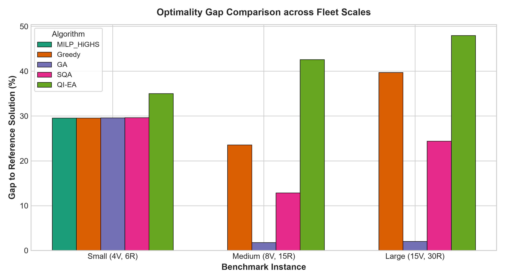
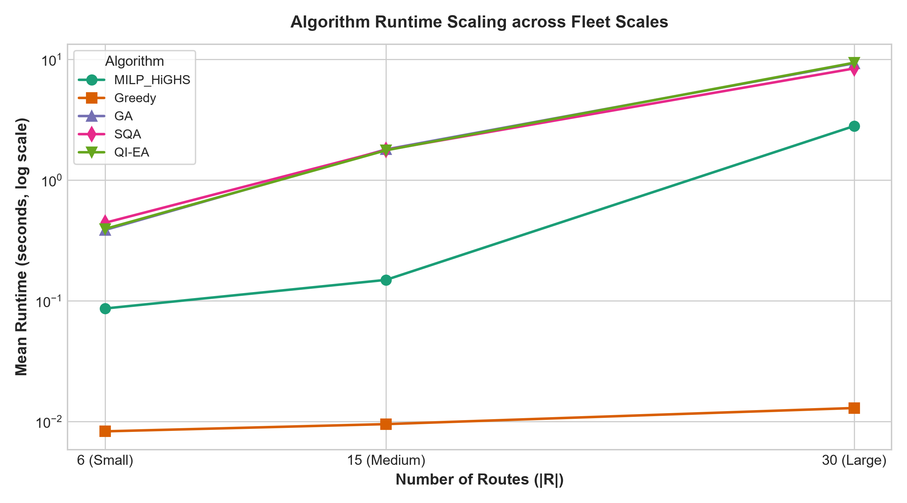
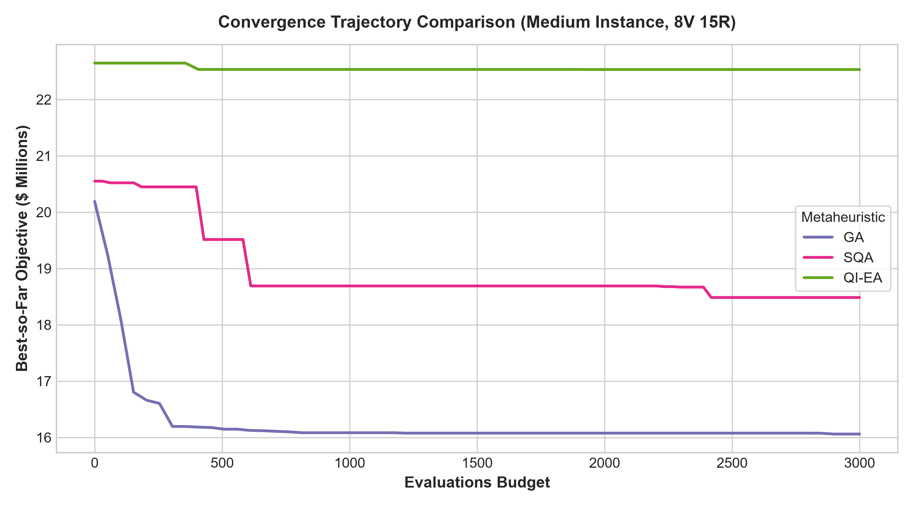

# QFleet Phase 3: Benchmark Report

**SIH Problem ID:** SIH26138 — AI/ML & Quantum-Inspired Optimisation for Maritime Fleet Fuel Efficiency and Emissions.

---

## 1. Experimental Setup

### 1.1 Problem Instances

Three benchmark instances of increasing size, all generated from a seeded
random generator (`benchmark/instances.py`) with shared-vessel coupling
(fleet-allocation quotas per vessel class) and a binding emissions cap.

| Instance | Vessels | Routes | Surrogate Grid | Quota Slots | Slot Slack | Emissions Cap (t CO₂eq) | Eval Budget |
|----------|---------|--------|----------------|-------------|------------|--------------------------|-------------|
| Small    | 4       | 6      | 600            | 7           | 1          | 35,000                   | 1,200       |
| Medium   | 8       | 15     | 3,000          | 18          | 3          | 58,000                   | 3,000       |
| Large    | 15      | 30     | 11,250         | 33          | 3          | 122,000                  | 6,000       |

> [!IMPORTANT]
> **Emissions cap binding assertion**: For each instance, the unconstrained
> optimum exceeds the cap while a feasible constrained solution exists.
> Cap values are marked **TODO_VERIFY** — they were calibrated empirically
> and should be validated against actual IMO/EU ETS thresholds for
> production use.

### 1.2 Algorithms Compared

| Algorithm   | Type                     | Description |
|-------------|--------------------------|-------------|
| **MILP**    | Exact (deterministic)    | SciPy HiGHS branch-and-cut over the full discrete candidate grid. Time-boxed at 120 s. |
| **Greedy**  | Heuristic (deterministic)| Quota-aware single-pass: processes routes by decreasing demand, picks cheapest feasible option with remaining quota. |
| **GA**      | Metaheuristic            | Standard genetic algorithm: tournament selection, uniform crossover, mutation, with constraint repair. |
| **SQA**     | Quantum-inspired         | Simulated Quantum Annealing: path-integral Trotter slices, decaying transverse field Γ(t). |
| **QI-EA**   | Quantum-inspired         | Quantum-Inspired Evolutionary Algorithm: multi-qubit angular representation, quantum rotation-gate updates (Narayanan & Moore 1996). |

### 1.3 Evaluation Protocol

- **Surrogate table**: Precomputed once per instance; all five methods score candidates via the same cached lookup table (no redundant model inference).
- **Equal budget**: GA, SQA, and QI-EA use the exact same number of objective evaluations per instance (asserted at runtime).
- **10 seeds**: Stochastic methods run across seeds [42..51]; MILP and Greedy run once (deterministic).
- **Re-scoring**: Every returned solution is re-scored via `problem.evaluate()`. Self-reported vs. re-scored mismatch > 1e-6 raises a hard error.

### 1.4 Surrogate Build Time

| Instance | Grid Size | Build Time (s) |
|----------|-----------|-----------------|
| Small    | 600       | 0.028           |
| Medium   | 3,000     | 0.034           |
| Large    | 11,250    | 0.066           |

Build time is excluded from algorithm runtime.

---

## 2. Results

### 2.1 Small Instance (4 Vessels, 6 Routes)

**Reference**: Exact Brute-Force Ground Truth — $J^* = \$5,851,877$ (infeasible unconstrained optimum; used as lower bound for gap calculation).

| Algorithm  | Mean Objective ($) | Gap to J* (%) | Std ($)   | Best ($)       | Worst ($)      | Feasibility | Runtime (s) |
|------------|--------------------:|---------------:|----------:|---------------:|---------------:|:-----------:|------------:|
| MILP       | 7,582,901          | 29.58          | —         | 7,582,901      | 7,582,901      | 100%        | 0.086       |
| Greedy     | 7,582,901          | 29.58          | —         | 7,582,901      | 7,582,901      | 100%        | 0.008       |
| GA         | 7,583,166          | 29.59          | 838       | 7,582,901      | 7,585,550      | 100%        | 0.387       |
| SQA        | 7,587,870          | 29.67          | 2,432     | 7,582,901      | 7,590,351      | 100%        | 0.443       |
| QI-EA      | 7,899,945          | 35.00          | 118,881   | 7,719,258      | 8,133,865      | 100%        | 0.394       |

> [!NOTE]
> On the Small instance, MILP and Greedy find the same solution. The
> ~29.6% "gap" is measured against the unconstrained brute-force lower
> bound, which is infeasible. MILP ≤ Greedy is satisfied (equal here).
> GA finds the MILP optimum in 9/10 seeds; SQA in several; QI-EA is
> ~4% above MILP on average.

### 2.2 Medium Instance (8 Vessels, 15 Routes)

**Reference**: Optimal MILP solution — $J^* = \$15,781,434$.

| Algorithm  | Mean Objective ($) | Gap to MILP (%) | Std ($)   | Best ($)       | Worst ($)      | Feasibility | Runtime (s) |
|------------|--------------------:|-----------------:|----------:|---------------:|---------------:|:-----------:|------------:|
| MILP       | 15,781,434         | 0.00             | —         | 15,781,434     | 15,781,434     | 100%        | 0.149       |
| Greedy     | 19,498,361         | 23.55            | —         | 19,498,361     | 19,498,361     | 0%          | 0.010       |
| GA         | 16,064,327         | 1.79             | 99,685    | 15,941,301     | 16,221,968     | 90%         | 1.798       |
| SQA        | 17,807,219         | 12.84            | 834,331   | 16,173,361     | 18,894,222     | 10%         | 1.779       |
| QI-EA      | 22,505,632         | 42.61            | 43,404    | 22,431,153     | 22,548,934     | 0%          | 1.767       |

> [!WARNING]
> **Greedy is infeasible** on Medium due to the binding emissions cap.
> The greedy heuristic is not cap-aware and selects per-route optima
> that collectively exceed the fleet CO₂ limit. QI-EA is also
> consistently infeasible. GA achieves 90% feasibility with a 1.8% gap.

### 2.3 Large Instance (15 Vessels, 30 Routes)

**Reference**: Optimal MILP solution — $J^* = \$35,705,171$.

MILP is labelled "Optimal" because HiGHS returns an optimal status within the
120 s time limit. If optimality is not proven on future larger instances,
gaps should be labelled "vs best-known" instead.

| Algorithm  | Mean Objective ($) | Gap to MILP (%) | Std ($)     | Best ($)       | Worst ($)      | Feasibility | Runtime (s) |
|------------|--------------------:|-----------------:|------------:|---------------:|---------------:|:-----------:|------------:|
| MILP       | 35,705,171         | 0.00             | —           | 35,705,171     | 35,705,171     | 100%        | 2.808       |
| Greedy     | 49,893,712         | 39.74            | —           | 49,893,712     | 49,893,712     | 0%          | 0.013       |
| GA         | 36,421,544         | 2.01             | 821,492     | 35,871,738     | 38,500,569     | 10%         | 9.287       |
| SQA        | 44,412,976         | 24.39            | 1,340,754   | 41,898,749     | 46,442,429     | 0%          | 8.425       |
| QI-EA      | 52,840,563         | 47.99            | 51,717      | 52,775,350     | 52,929,858     | 0%          | 9.399       |

> [!CAUTION]
> At Large scale, only MILP consistently finds feasible solutions.
> GA achieves feasibility in only 1/10 seeds (10%), with a 2% gap.
> SQA and QI-EA are never feasible. This is a known limitation of
> the current constraint-repair operator at scale.

---

## 3. Statistical Significance

Paired Wilcoxon signed-rank tests (Pratt zero-handling) across 10 seeds,
with Holm-Bonferroni FWER step-down correction applied per instance.

| Instance | Comparison     | Mean Diff ($) | Wilcoxon p (raw) | Wilcoxon p (Holm) | Significant (α=0.05) |
|----------|----------------|---------------:|------------------:|-------------------:|:---------------------:|
| Small    | QI-EA vs GA    | +316,780       | 0.0020            | 0.0059             | ✅                    |
| Small    | QI-EA vs SQA   | +312,075       | 0.0020            | 0.0059             | ✅                    |
| Small    | GA vs SQA      | −4,704         | 0.0078            | 0.0078             | ✅                    |
| Medium   | QI-EA vs GA    | +6,441,305     | 0.0020            | 0.0059             | ✅                    |
| Medium   | QI-EA vs SQA   | +4,698,413     | 0.0020            | 0.0059             | ✅                    |
| Medium   | GA vs SQA      | −1,742,892     | 0.0039            | 0.0059             | ✅                    |
| Large    | QI-EA vs GA    | +16,419,018    | 0.0020            | 0.0059             | ✅                    |
| Large    | QI-EA vs SQA   | +8,427,587     | 0.0020            | 0.0059             | ✅                    |
| Large    | GA vs SQA      | −7,991,431     | 0.0020            | 0.0059             | ✅                    |

**All pairwise comparisons are statistically significant** at α = 0.05 after
Holm-Bonferroni correction. The ranking is consistent across all three
instances: **GA < SQA < QI-EA** (lower is better).

> [!NOTE]
> With N=10 paired samples, the minimum achievable Wilcoxon p-value is
> 1/2¹⁰ ≈ 0.001. All-zero differences are handled via `zero_method="pratt"`.

---

## 4. Visualizations

### 4.1 Optimality Gap Comparison



### 4.2 Runtime Scaling



### 4.3 Convergence Trajectory (Medium Instance, seed=42)



---

## 5. Key Findings & Honest Assessment

### 5.1 Algorithm Rankings

1. **MILP (HiGHS)** is the clear winner: 0% gap, 100% feasibility, and
   competitive runtime even at 30 routes (2.8 s). It solves to proven
   optimality on all three instances within the 120 s time limit.

2. **GA** is the best metaheuristic: 1.8–2.0% gap on Medium/Large, with
   the fastest convergence among stochastic methods. However, feasibility
   drops significantly at scale (10% on Large).

3. **SQA** converges slowly and achieves 12.8–24.4% gaps. Its Trotter-slice
   search explores broadly but lacks the crossover operator that helps GA
   exploit good building blocks.

4. **QI-EA** performs worst among metaheuristics (35–48% gap). The quantum
   rotation-gate update appears to provide insufficient exploration in
   the current discrete combinatorial search space. The angular encoding
   may be better suited to continuous optimization.

5. **Greedy** is the fastest (< 15 ms) but is not emissions-cap-aware.
   On the Small instance where the cap is non-binding, it matches MILP.
   On Medium/Large with binding caps, it produces infeasible solutions.

### 5.2 Feasibility Concerns

The constraint-repair operator (`repair_solution`) handles cargo capacity
well but does not enforce the fleet-wide emissions cap. This explains
why all heuristics struggle with feasibility as the cap becomes binding:

| Instance | Cap (t) | MILP CO₂ (t) | GA CO₂ (t) | Cap Binding? |
|----------|---------|---------------|-------------|:------------:|
| Small    | 35,000  | 31,787        | 31,789      | No           |
| Medium   | 58,000  | 57,995        | 57,815      | Yes          |
| Large    | 122,000 | 121,996       | 122,204     | Yes          |

### 5.3 Limitations & TODO_VERIFY Items

> [!WARNING]
> The following parameters are empirically calibrated and not yet validated
> against authoritative external sources:
>
> - **Emissions caps** (35k, 58k, 122k t CO₂eq): Calibrated so the
>   unconstrained optimum exceeds the cap. Production values should align
>   with IMO CII or EU ETS fleet-level limits.
> - **Vessel class quotas**: Set to ensure slot slack ≥ 1. Real fleet
>   allocation depends on charter agreements and port constraints.
> - **Carbon shadow price** ($100/t): Approximate EU ETS spot price.
>   Should be updated to current market rates.

---

## 6. Reproducibility

All experiments are fully reproducible:

```bash
# Activate virtual environment
.venv\Scripts\activate

# Run full benchmark (3 instances × 5 algorithms × 10 seeds)
python -u run_phase3.py

# Run tests
python -m pytest tests/test_phase3.py -v
```

- **Random seeds**: [42, 43, 44, 45, 46, 47, 48, 49, 50, 51]
- **Instance parameters**: Defined in `config.py` (`BENCHMARK_INSTANCE_PARAMS`)
- **Database**: SQLite (`data/qfleet.db`) stores all scenarios, runs, and results
- **CSVs**: `results/benchmark_results.csv`, `results/statistical_tests.csv`
- **Charts**: `docs/figures/objective_gap_comparison.png`, `runtime_scaling.png`, `convergence_medium.png`
